<picture>
  <source media="(prefers-color-scheme: dark)" srcset="./dark.svg">
  <source media="(prefers-color-scheme: light)" srcset="./light.svg">
  
</picture>

<div align="center">

[](mailto:vamsitha7@gmail.com)
[](https://www.linkedin.com/in/vamsitha-gude/)
[](https://github.com/vamsitha07)


</div>

---

## About

AI/ML Engineer with 4+ years taking models from research notebooks to monitored
production endpoints on AWS and Azure. My work sits on both sides of the handoff:
feature engineering with point-in-time correctness, cross-validation and probability
calibration, champion-challenger evaluation — and then the part that decides whether any
of it survives contact with production, which is SageMaker training pipelines, an MLflow
registry with real promotion gates, Arize drift monitoring, and automated rollback.

Recent work is generative AI in production on Amazon Bedrock: Guardrails,
LLM-as-a-judge evaluation, retrieval-augmented generation, and ReAct agents with tool
calling — shipped under the same review, cost-attribution, and rollback discipline as a
predictive model.

I came to ML through data engineering, and it shows in what I pay attention to: a model
is only as reproducible as its feature pipeline, and most "model problems" turn out to be
lineage, leakage, or a silently re-derived field.

**Currently:** AI/ML Engineer @ Vanguard — Malvern, PA.

---

## How a model gets to production

```
  features ──▶ training ──▶ evaluation ──▶ promotion gates ──▶ endpoint ──▶ monitoring
  point-in-time  SageMaker   champion vs.   MLflow card ·      shadow ·     Arize drift ·
  correctness    + MLflow    challenger,    offline eval ·     traffic      PSI · latency ·
  no leakage     tracking    by segment     shadow · split ·   split        auto-rollback
                                            risk approval
```

Five gates, pass criteria negotiated with business owners — precision tolerance,
false-positive volume caps, per-segment regression checks, a p99 latency budget — and
rollback that fires on sustained latency breach, error rate, PSI drift, or feature
retrieval failure without waiting for a human.

---

## Experience

### AI/ML Engineer · Vanguard — Malvern, PA
`Sep 2025 – Present`

**Model development and validation**

- Productionized research models on SageMaker, refactoring monolithic notebook code into
  modular feature engineering, training, inference, and post-processing stages with
  explicit parameter passing and artifact handoff.
- Enforced point-in-time correctness so a feature computed for training uses only
  information available at the decision point; diagnosed a class of silent feature
  defects — entity identifier changes across mergers and spin-offs, fiscal year-end
  shifts that misalign panels — and documented the resolution rules.
- Corrected class imbalance through resampling and calibrated outputs with isotonic
  regression, validating calibration separately from ranking so downstream processes can
  consume scores as probabilities.
- Evaluated every challenger against the incumbent on a shared holdout, broken out by
  segment so an overall gain can't mask a segment regression, weighing precision against
  false-positive volume because each false positive is investigator workload.
- Produced SHAP attributions for model review and checked top-feature stability across
  runs to separate genuine signal from data-quality artifacts.
- Consolidated per-model bespoke pipelines into one configuration-driven training
  framework, so a new model type onboards through configuration alone.

**MLOps, deployment, and monitoring**

- Shipped models through five promotion gates (MLflow registration with model card,
  offline champion-challenger, shadow scoring on live traffic, limited traffic split,
  model risk approval) with automated rollback returning a model to shadow pending root
  cause.
- Migrated the platform off SageMaker Pipelines onto Step Functions and ECS, engineering
  completion polling, deterministic job naming for idempotency, quota backoff, and
  orphaned-job cancellation; EventBridge triggers runs on data availability rather than a
  fixed schedule.
- Instrumented production models in Arize for drift, data quality, and performance with
  custom baselines and alert thresholds; standardized MLflow tracking so any run
  reproduces from its logged parameters, metrics, and artifacts.
- Proved the data feeding production models by building lineage from pipeline run events,
  diffing declared against observed lineage, and reconciling row counts at every hop.
- Replaced ticket-driven provisioning with a self-service platform teams drive from code,
  and led its rollout across engineering, staging, and production.
- Cleared firm security and model risk review — application registration, business impact
  assessment, security architecture review, threat and risk assessment — and replaced
  pickle-based model loading with a safe serialization path.

**Generative AI**

- Delivered a multi-stage GenAI commentary pipeline on SageMaker serving 13 business
  divisions, with ingestion, metrics extraction, prompt generation, insight generation,
  and executive summary as independent stages.
- Eliminated manual sample review by adding Bedrock Guardrails and LLM-as-a-judge
  evaluation on G-Eval metrics, then moved judge calls onto Bedrock application inference
  profiles for per-application cost attribution and throughput control over a previously
  untracked shared quota.
- Benchmarked embedding models on generation and retrieval metrics and deployed the
  winner as a managed endpoint with custom search logic, retiring notebook-based
  retrieval; built a Bedrock + Claude ReAct agent with tool calling in Microsoft Teams
  that turns natural-language requests into validated, deployment-ready configuration.

### Data Scientist · Cigna Healthcare — Dallas, TX
`Dec 2024 – Sep 2025`

- Built the feature preparation layer for clinical and claims models — cohort
  construction, encoding of coded clinical fields, and point-in-time joins that
  eliminated target leakage from data unavailable at the decision date.
- Converted notebook feature logic into production PySpark transformations and reconciled
  output row by row before cutover, so retrained models reproduced research results
  exactly.
- Engineered the pipeline turning legacy mainframe clinical and member data into
  standards-compliant resources (patient, observation, coverage, claim), delivering
  curated datasets to a clinical data repository for training and API consumption.
- Architected a four-layer platform on ADLS Gen2 — landing, conform, semantic, elastic —
  each stage independently testable and safely re-runnable, with quality gates blocking
  defective records before they reach model inputs.
- Standardized clinical terminologies in the semantic layer so downstream models shared
  one set of feature definitions, and produced the field-level mappings and data
  dictionary the modeling team adopted as reference.

### Data Engineer · Cadence Design Systems — India
`Aug 2021 – Aug 2023`

- Owned the feature stores and curated datasets behind predictive modeling and analytics
  reporting, including refresh schedules and input contracts.
- Automated batch scoring and dataset refresh with failure alerting and rerun paths,
  replacing manual notebook execution and delivering predictions straight to the
  warehouse.
- Versioned training datasets with queryable per-experiment snapshots, keeping model
  results reproducible after upstream tables changed.
- Engineered Snowflake integrations with external stages, streams, and incremental tasks;
  implemented cataloging and lineage across Snowflake and Glue Data Catalog for impact
  analysis when an upstream schema change threatened a model already in production.
- Released ETL and scoring jobs through blue/green and canary deployments, and tuned
  Spark partitioning and serverless workloads to cut runtime and compute cost.

---

## Technical skills

**Languages & Libraries**


Python, SQL, PySpark, Spark SQL, Scala, scikit-learn, pandas.

**Machine Learning**

Feature engineering, point-in-time correctness, cross-validation, class imbalance and
resampling, probability calibration (isotonic), backtesting, champion-challenger
evaluation, shadow deployment, A/B traffic splitting, SHAP attribution, drift and
population stability index (PSI) monitoring.

**Generative AI & LLMOps**


Amazon Bedrock, Claude, prompt engineering, retrieval-augmented generation, embedding
models and vector search, ReAct agents and tool calling, LLM-as-a-judge and G-Eval
evaluation, Bedrock Guardrails, application inference profiles, agent tracing.

**MLOps & Monitoring**


MLflow experiment tracking and model registry, SageMaker training / processing /
endpoints, Arize model monitoring, model cards, model lineage, artifact and dataset
versioning, promotion gates, automated rollback, batch and real-time inference.

**AWS**


SageMaker, Bedrock, Step Functions, EventBridge, ECS and Fargate, Lambda, S3, Glue,
Athena, Redshift, IAM, KMS, Secrets Manager, VPC endpoints and PrivateLink, CloudWatch,
SNS and SQS.

**Data & Lakehouse**


Databricks, Delta Lake, Apache Iceberg, Unity Catalog, ADLS Gen2, Snowflake, PostgreSQL,
medallion architecture, change data capture, SCD Type 2.

**DevOps & Testing**


Docker, Terraform, CloudFormation, Git, GitHub Actions, CI/CD, OIDC federation, pytest,
ruff, mypy, OpenTelemetry.

**Model Governance**

Model risk management, business impact assessment, security architecture review, threat
and risk assessment, audit trails and lineage evidence.

---

## Currently building (public repos, in progress)

The production systems above are proprietary, so these are the runnable versions of the
same patterns.

- **mlops-pipeline** — train → MLflow registry → FastAPI + Docker serving, with the
  promotion gates wired in: offline challenger eval, shadow scoring, and a rollback
  trigger. *(MLOps)*
- **rag-service** — retrieval-augmented Q&A with a working API, retrieval metrics, and an
  LLM-as-a-judge eval harness rather than eyeballed samples. *(Applied GenAI)*
- **agent-tooling** — a ReAct agent with tool calling and structured output, traced
  end to end, that turns a natural-language request into validated config. *(Agents)*
- **feature-pipeline-iac** — Terraform-provisioned feature pipeline with point-in-time
  joins and dataset versioning, feeding the two projects above. *(Features → ML)*

---

## Education & Certifications

- **M.S., Computer Information Systems** — Colorado State University
- **B.Tech** — Vignan Foundation for Science, Technology and Research
- **AWS Certified Solutions Architect – Associate**
- **AWS Certified Machine Learning Engineer – Associate**
- **Microsoft Certified: Azure Data Engineer Associate**

---

## Open to

AI/ML Engineering · MLOps / LLMOps · Machine Learning Platform Engineering · Applied
GenAI. Based in the US.

<div align="center">

**From research notebook to monitored production endpoint.**

</div>
