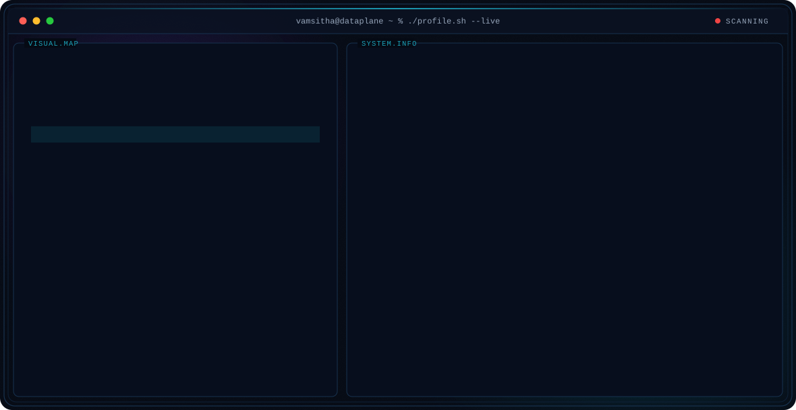

<picture>
  <source media="(prefers-color-scheme: dark)" srcset="./dark.svg">
  <source media="(prefers-color-scheme: light)" srcset="./light.svg">
  
</picture>

<div align="center">

[](mailto:vamsithachowdary@gmail.com)
[](https://www.linkedin.com/in/vamsitha-gude/)
[](https://github.com/vamsitha07)


</div>

---

## About

Data engineer specialising in **Palantir Foundry**, with four years building the
pipelines, ontologies and automations that operational teams depend on.

I work across the whole path inside Foundry: onboarding sources through Data
Connection, writing PySpark transforms in Code Repositories with incremental
builds and health checks, modelling the Ontology, and building AIP Logic and
Agent Studio workflows that act on that data with permissions, write-back and
audit intact.

Before Foundry I built healthcare data pipelines on Azure Databricks, and
warehouse and feature infrastructure on Snowflake and AWS — so I am comfortable
with the platforms a Foundry deployment has to integrate with.

**I care as much about whether a dataset can be traced, reproduced and explained
as whether it landed on time, and I ask what a number is for before I ask how to
compute it.**

**Currently:** Palantir Data Engineer @ Vanguard — Enterprise Data Platform,
Foundry Engineering. Malvern, PA.

---

## The path a decision takes

```
  sources ──▶ transforms ──▶ datasets ──▶ ONTOLOGY ──▶ applications
  Data Connection  PySpark      health checks   object · link    Workshop · Contour
  agent · JDBC     incremental  branch builds   Action Types     SDK · Foundry APIs
                                                     │
                                       AIP Logic · Agent Studio · Automate
```

The Ontology is the load-bearing part. Everything upstream exists to make it
trustworthy; everything downstream — the Workshop screen an analyst uses, the
agent answering a question, the React app calling the SDK — reads the same
model, so the joins live in one place rather than in whatever SQL each team
wrote that week.

---

## Experience

### Palantir Data Engineer · Vanguard — Malvern, PA (hybrid)
`Sep 2025 – Present` · Enterprise Data Platform, Palantir Foundry Engineering

**AIP logic, TypeScript functions and automation**

- Built AIP Logic functions over Ontology objects: a user question resolves to
  an object set, tools run against the data model, and the answer comes back
  traceable to records.
- Designed multi-step Logic boards mixing LLM blocks, function calls and
  conditional branching. Every step is typed against Ontology properties, so a
  renamed property breaks the build instead of quietly changing an answer.
- Built Agent Studio agents with tool access scoped to named object types and
  Action Types — an agent can look things up, summarise and propose a write-back,
  and Foundry permissions still decide what it sees.
- Evaluated prompt and logic changes with AIP Evals against a labelled set of
  real cases, and made an accuracy drop a release blocker. Unit tests are no
  help when the same input can return a different answer each run.
- Wrote TypeScript Functions on Objects using object set filters, search-around
  traversals and server-side aggregations — exposed as function-backed properties
  and as AIP Logic tools, so agents, Workshop modules and API consumers all call
  one typed implementation.
- Generated the Ontology SDK and built a React front end on it, handling OAuth
  client credentials, paginated object set queries and Action invocation.
- Covered function logic with Jest tests and made type checks and linting
  repository checks on every commit. A broken function fails at merge, not in a
  live Workshop module.

**Ontology modelling**

- Modelled the Ontology over curated datasets — object types, properties,
  primary keys, titles and the link types between them — so business users query
  entities and the joins live in the model.
- Defined Action Types with parameter validation, submission criteria and edit
  rules, moving operational decisions off spreadsheets and into the Ontology with
  an audit trail behind them.
- Pinned down the canonical definition of each core entity with its business
  owner before modelling it. **An ontology carrying two definitions of the same
  entity is worse than no ontology.**

**Delivery**

- Delivered Workshop applications wiring object sets, filters, action buttons and
  charts into one screen for the operational team.
- Packaged pipelines, Ontology objects and applications as Foundry Marketplace
  products, so another environment installs and configures the solution instead
  of rebuilding it.
- Migrated legacy external pipelines into Foundry. The migration was scoped as an
  infrastructure move; the real exposure was lineage and reproducibility, and I
  flagged that early.

### Data Engineer · Cigna Healthcare
`Aug 2024 – Aug 2025` · Healthcare data integration on Azure Databricks

- Built the pipeline that pulled clinical and member data out of mainframe-era
  systems and emitted standards-compliant resources for patient, observation,
  coverage and claim into a clinical data repository.
- Designed the landing, conform, semantic and elastic layers on ADLS Gen2 — each
  stage does one job, gets tested on its own, and reruns cleanly from raw extract
  to production output.
- Built incremental ingestion with Auto Loader and schema evolution; Delta Lake
  merge-based upserts and Type 2 history across the conform and semantic layers.
- Implemented protected health information controls with column-level masking,
  restricted access on identifiable fields and audit logging, and produced the
  evidence compliance needed for HIPAA sign-off.
- Wrote pytest tests for the transformation modules and reconciled output
  resource counts against source control totals on every load — a silent upstream
  change shows up as a reconciliation break.

### Data Engineer · Cadence Design Systems
`Aug 2021 – Aug 2023` · Data and feature infrastructure for analytics and ML teams

- Delivered the curated datasets and feature stores that analytics and machine
  learning teams built their models and reporting on.
- Developed cataloguing and lineage across Snowflake and the Glue Data Catalog,
  giving teams real impact analysis when an upstream change threatened a
  downstream model.
- Implemented data quality, profiling and validation frameworks, so accuracy,
  consistency and completeness were measured numbers and not assumptions.
- Tuned warehouses, clustering keys and query patterns — right-sizing compute,
  enforcing auto-suspend and removing repeated full table scans from the heaviest
  scheduled queries.

---

## Core skills

**Palantir Foundry**

Code Repositories · PySpark transforms · incremental transforms · Pipeline
Builder · Data Connection with agent, JDBC and file-based syncs · dataset and
branch builds · schedules with dataset and event triggers · connected builds ·
data health checks · lineage and impact analysis · Projects and roles · Markings
and Restricted Views · Workshop · Contour · Quiver · Slate · Foundry APIs ·
Marketplace

**Ontology and AIP**

Object types, properties and link types · Action Types and governed write-back ·
Foundry Functions and TypeScript Functions on Objects · Ontology SDK with React,
Node and Jest · Object Storage V2 · AIP Logic · AIP Agent Studio · AIP Automate ·
Ontology automations · AIP Evals · retrieval and tool calling over Ontology
objects · prompt engineering · model guardrails

**Data engineering**


Python · PySpark · Spark SQL · SQL · Delta Lake · Apache Iceberg · layered
medallion architecture · incremental and change data capture loads · SCD Type 2 ·
point-in-time correctness · dimensional modelling · curated feature datasets ·
partitioning, clustering and Spark performance tuning

**Platforms and cloud**


Databricks · ADLS Gen2 · Azure Data Factory · Snowflake with Snowpipe, streams
and tasks · warehouse tuning and masking policies · AWS with S3, Glue and Glue
Data Catalog, Athena, EMR, Lambda, Step Functions, EventBridge, IAM and KMS ·
PostgreSQL

**Governance and quality**

Ingestion validation and quarantine · control-total reconciliation · freshness,
schema and uniqueness checks · row- and column-level access · protected health
information and HIPAA handling · retention and audit evidence · data dictionaries
and source-to-target mappings · Git branching and code review · CI/CD with GitHub
Actions · pytest · monitoring and alerting

---

## Currently building

**Site Watch** — a clinical trial site-monitoring application built end to end on
a Foundry Developer Tier instance: ClinicalTrials.gov data through PySpark
transforms with incremental builds and health checks, an ontology of trials,
sites, sponsors and conditions, Action Types for governed write-back, an AIP
Logic board with a hand-labelled eval set, and a React front end on the generated
Ontology SDK. Public write-up when it is finished, including the eval score and
the regression that caught it.

---

## Education and certifications

- **M.S., Computer Information Systems** — Colorado State University
- **B.Tech** — Vignan Foundation for Science, Technology and Research
- **AWS Certified Solutions Architect – Associate**
- **Microsoft Certified: Azure Data Engineer Associate**
- **Speedrun: Your First AIP Workflow** · **Deep Dive: Creating Your First Ontology Function** · **Deep Dive: Building Your First Application**

---

## Open to

Palantir Foundry engineering · data platform engineering · data engineering —
roles where the ontology and the pipeline are the same job. Based in the US.

<div align="center">

**Pipelines, ontologies and automations operational teams depend on.**

</div>
